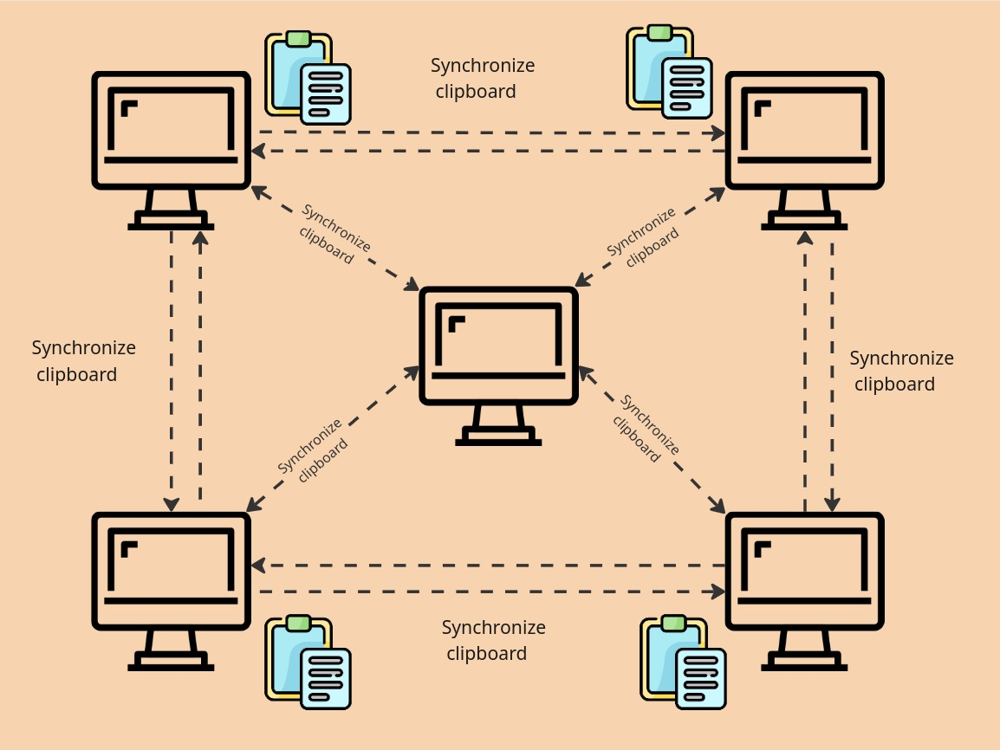

# Clipboard Sync

## Architecture
<p align="center">
  
</p>

A tool for synchronizing clipboard content between Linux devices using Peer-to-Peer (P2P) architecture with automatic peer discovery on local networks.

## Features

- **P2P Synchronization**: Automatically connects multiple devices on the same network
- **Auto Discovery**: Finds other devices running Clipboard Sync automatically
- **Real-time**: Instant synchronization when clipboard changes
- **Native**: Uses native X11 implementation in C for maximum performance
- **Compatibility**: Maintains legacy client-server mode for compatibility
- **Mesh Network**: Propagates changes through all connected peers

## Quick Installation

```bash
# Clone the repository
git clone https://github.com/victorvcruz/clipboard-sync.git
cd clipboard-sync

# Run the installation script
./scripts/install.sh
```

## Prerequisites

- **Linux** with X11
- **Go 1.21+** (for compilation)
- **libX11-dev** (automatically installed by script)

## Usage

### P2P Mode (Default)

Simply run on each device you want to synchronize:

```bash
# Basic mode - automatically discovers peers
clipboard-sync

# Check your IP for other devices to connect
clipboard-sync --ip

# With custom ports
clipboard-sync -port 9000 -discovery-port 9091

# With custom ID
clipboard-sync -source-id "my-desktop"
```

### Client-Server Mode

For compatibility with previous versions:

```bash
# On server device
clipboard-sync -p2p=false

# On client device
clipboard-sync -p2p=false -target 192.168.1.100
```

## Command Line Options

### P2P Mode
- `-port <PORT>`: HTTP port for communication (default: 8080)
- `-discovery-port <PORT>`: UDP port for peer discovery (default: 9090)
- `-source-id <ID>`: Device identifier (auto-generated if omitted)

### Client-Server Mode
- `-p2p=false`: Enable client-server mode
- `-target <IP>`: Target device IP (required for client-server)
- `-target-port <PORT>`: Target device port (default: 8080)

### General
- `-version`: Show version information
- `-ip`: Show accessible IP address for other devices
- `-h`: Show help

## How It Works

### P2P Architecture

1. **Discovery**: Each device sends UDP broadcasts on the local network
2. **Connection**: Discovered devices connect via HTTP
3. **Synchronization**: Clipboard changes are propagated to all peers
4. **Mesh Network**: Peers relay changes to ensure everyone receives them

### Loop Prevention

- **Source Tracking**: Each message maintains the original device ID
- **Deduplication**: Avoids processing the same change multiple times
- **Timeout**: Ignores duplicate changes within time windows

## Network Example

```
Device A ←→ Device B
    ↕         ↕
Device C ←→ Device D
```

When you copy something on Device A, it's automatically synchronized to B, C, and D.

## IP Discovery

To see your device's accessible IP for other devices:

```bash
clipboard-sync --ip
```

This will return the IP address that other devices can use to connect to your device, prioritizing wireless and ethernet interfaces over virtual/Docker interfaces.